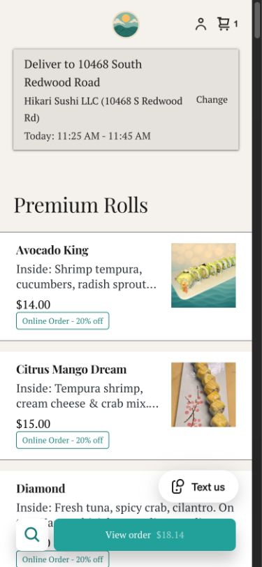

# Square ordering improvements — published

September 23, 2026 · Authenticated inspection, followed by Joel’s explicit implementation approval

The ordering page now puts food choices directly below pickup/delivery selection. These are native Square changes; no custom checkout, API integration or website rebuild was introduced.

## Final changes

| Before | Published result | Reversal |
|---|---|---|
| Large two-slide main banner separated delivery selection from food | **Main banner hidden**; its slides/assets remain saved | Editor → Main banner → enable/show section → Publish |
| Two narrow photo cards per row on mobile, with large placeholders for missing photos | **Compact menu layout**: one horizontal item per row on mobile; two columns on desktop; small photos where available | Editor → Item list → Layout → previous two-photo-card preset (second option) → Publish |
| Full-screen “Order Direct & Save 20%” announcement interrupted browsing | **Announcement pop-up inactive**, not deleted | Website settings → Pop-ups → existing Announcement pop-up; reactivate/publish through Square’s controls |

The 20% discount remains visible on item cards and was verified in both pickup and delivery carts. Colors, typography, item content, prices, discounts, tips, fees, hours, shipping eligibility, delivery rules, payment connections and POS/KDS/provider integrations were not changed.

The frontend-design guidance informed a restrained approach: retain Hikari’s existing identity, use actual purchasable food as the visual focus, and remove elements that delay the next action. No extra instruction section was added because it would push food down again.

## Actual Hikari controls confirmed

- **Square Plus** subscription; restaurant **Order Online** template. This resolves the earlier report’s account-specific unknowns.
- Main banner supports hiding and XS/S/M/L height choices.
- Item list offers layout, category navigation, search, images, titles, prices, descriptions, badges and item-dialog controls. Item order follows the Square catalog; no catalog changes were made.
- Header offers Sticky header, Reveal on scroll up and No effects. Cart/search icons are enabled. The fulfillment bar cannot be removed from the Order Online page using its visibility setting.
- Checkout already has Apple Pay, Google Pay and Cash App enabled. Optional buyer/recipient address collection and customer notes are off; marketing opt-in is on. Free-delivery progress meter is already on; group ordering is off. The default fulfillment is Local Delivery. These settings were inspected, not changed.

### Cart finding and a reverted experiment

The header was temporarily switched from **Reveal on scroll up** to **Sticky header**, published and tested. It did **not** produce an always-visible cart header on this ordering template: the category navigation occupied the top of the scrolled page. The original Reveal on scroll up setting was restored and published. Do not count sticky-header behavior as a delivered improvement.

More importantly, the live mobile storefront **already provides a fixed “View order” button and amount after adding food**. It stayed visible while browsing and opened the cart successfully. This supersedes the earlier report’s “persistent cart remains unverified” note. It is an existing native behavior verified here, not a new custom feature.

## Verification performed

- Square displayed **Site published** after the layout changes and again after restoring the original header setting.
- Inspected mobile at a 390 × 844 browser viewport and desktop at 1365 × 900, plus Square’s editor previews. These are browser checks, not physical-phone checks.
- Live pickup selection returned to the menu without the slideshow or announcement; an initially empty cart accepted one Firefly Fusion.
- Pickup cart showed $15 item price, −$3 discount, $0.89 tax and the existing $1.50 tip, for **$14.39**. It reached the real contact/payment form.
- Delivery selection used **Hikari’s public restaurant address**, not Joel’s private address. It returned directly to the food list with delivery selected. This validates the interface, not delivery range at a customer’s home.
- Delivery cart and payment entry showed the same $12 discounted food amount, $4.25 delivery, $1 service charge, $0.89 tax and $2.25 courier tip, for **$20.39**. The existing $50 free-delivery progress meter also appeared.
- No contact/payment details were entered; **Place order was never clicked**. No real order, payment, courier dispatch or KDS ticket was generated. The temporary item was removed afterward.

The initial delivery dialog quoted $6.10, while the subsequent cart showed $4.25 delivery plus $1 service charge for this test address. The quote-to-cart discrepancy also existed in Joel’s earlier screenshots with different amounts. No fee settings were changed. This needs a focused Square explanation if Joel wants to pursue it; do not call the pricing perfectly consistent.

## Remaining platform limits / scope

- Square still owns the fulfillment dialog, cart and payment form. “Shipping” remains an option; hiding it would require auditing legitimate item/fulfillment eligibility rather than guessing and changing operations.
- No new permanently visible desktop cart control was established. Mobile’s native View order button is confirmed.
- This did not verify a completed transaction, courier assignment, or physical KDS/terminal receipt. Existing integrations were left untouched, not newly certified end-to-end.
- No domain/DNS change, plan upgrade, new customer-account system, custom scripts or production repository code changes.
- A main-website redesign and analytics/image improvements from the original audit remain separate work.

## Screenshots

Captured from the published page during verification. The delivery address shown is the public restaurant address. The final header restoration does not change these top-of-page layouts.

[Desktop ordering page](screenshots/square-after-desktop-delivery.png)

Earlier documentation research and primary sources: [Square customization analysis](03-SQUARE-CUSTOMIZATION.md).
