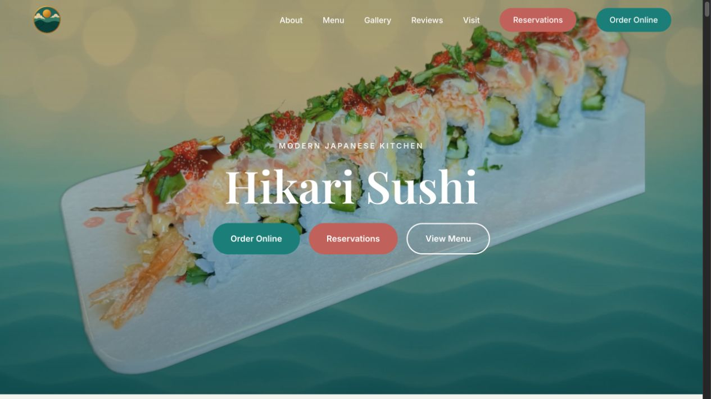
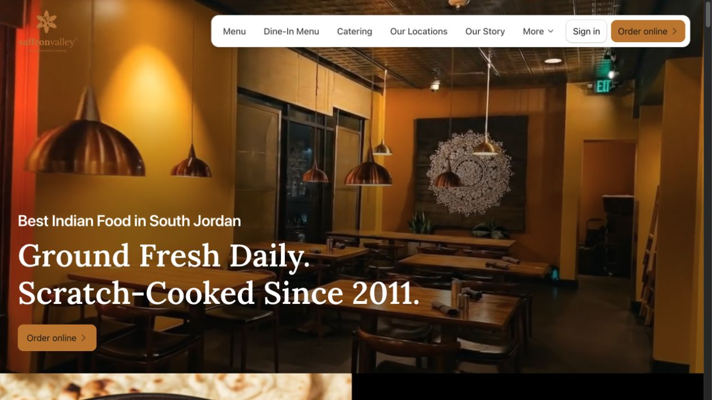
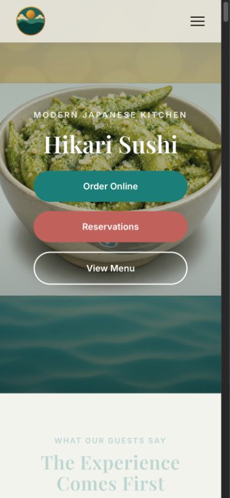
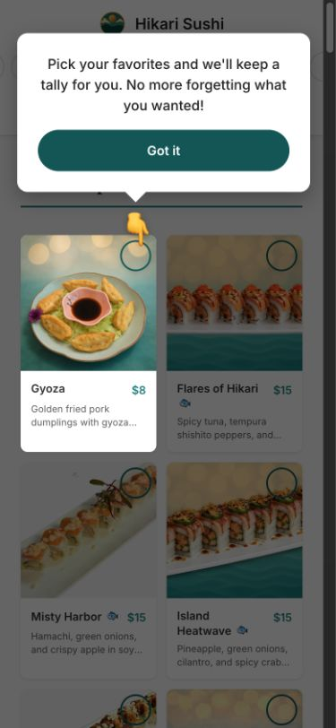
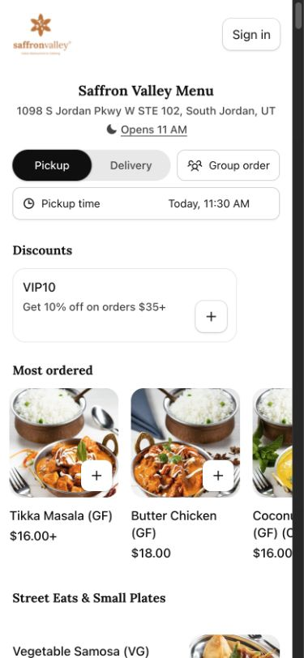

# Visual evidence

Captured September 23, 2026. Reference screenshots document the inspected pages; they are not a proposed new Hikari design. Video frames vary between captures.

## Published Square improvements

These later captures show the authorized native Square changes, not the original pre-change audit. Delivery uses Hikari’s public business address for testing.

- [Mobile: food immediately visible, fixed View order button](square-after-mobile-delivery.png)
- [Desktop: compact menu below fulfillment](square-after-desktop-delivery.png)
- [Change record and verification limits](../04-SQUARE-LIVE-IMPROVEMENTS.md)

## Desktop heroes

Hikari:

Saffron:

## Mobile heroes

Hikari:

Saffron, showing persistent order action:

## Mobile menus

Hikari’s menu and picks onboarding:

Saffron’s menu for purchasing:

## Additional captures

- [Saffron desktop split section](saffron-desktop-sections.jpg)
- [Saffron full desktop page](saffron-desktop-full.jpg)
- [Saffron desktop menu](saffron-desktop-menu.jpg)
- [Saffron item choices and add-ons](saffron-item-upsells.jpg)
- [Saffron checkout](saffron-checkout.jpg)
- [Hikari Square entry](hikari-square-entry.jpg)
- [Hikari Square discount overlay](hikari-square-promotion.jpg)
- [Hikari Square cart](hikari-square-cart.jpg)

The mobile inspections use a 390 × 844 browser viewport, not a physical device. The screenshot service scales most saved mobile images to 375 × 812 and desktop images to 1265 × 712; inspect the CSS measurements in the design reference for layout dimensions. The hero images show the beginning of the next section; entrance animations can leave offscreen/entering text faded during a frame.
